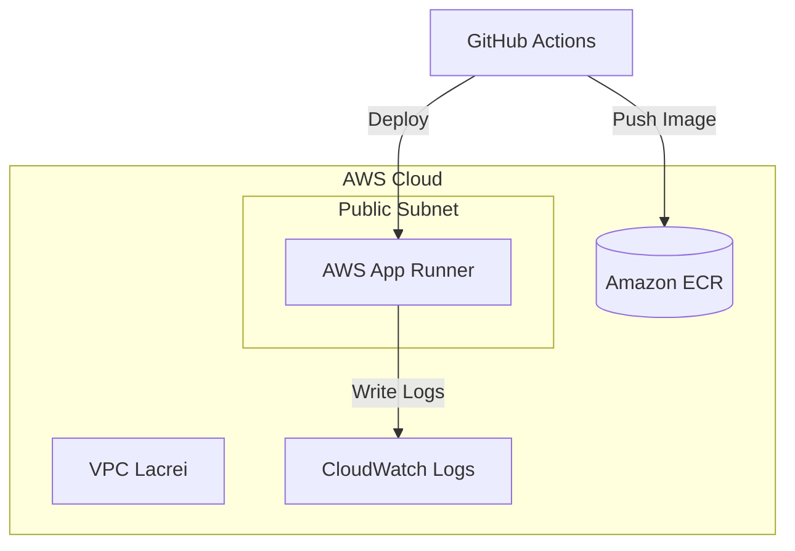

# Desafio DevOps - Lacrei Saúde

Este projeto contém a solução completa para o desafio de DevOps, incluindo Dockerização, CI/CD, AWS e Observabilidade.

## 🚀 Estrutura do Projeto

- `app.js`: Aplicação Node.js com Express e gerenciamento de segredos.
- `app.test.js`: Testes automatizados (Jest + Supertest).
- `Dockerfile`: Build multi-stage otimizado.
- `.github/workflows/main.yml`: Pipeline completa de CI/CD.

## 🛠️ Pipeline CI/CD (GitHub Actions)

A pipeline é acionada em cada `push` ou `pull_request` para as branches `main` e `staging`.

1.  **Lint & Test**: Executa `eslint` para garantir a qualidade do código e `jest` para os testes funcionais.
2.  **Build & Push**: Constrói a imagem Docker e a envia para o **Amazon ECR**.
3.  **Deploy**:
    *   **Staging**: Deploy automático quando há push na branch `staging`.
    *   **Production**: Deploy automático quando há push na branch `main` (requer aprovação se configurado via GitHub Environments).

## 🌍 Ambientes

| Ambiente | Host (Exemplo) | Descrição |
| :--- | :--- | :--- |
| **Staging** | `staging.lacreisaude.com.br` | Validação de novas features. |
| **Production** | `app.lacreisaude.com.br` | Ambiente final de usuários. |

## 🔄 Estratégia de Rollback

Em caso de falha no deploy:
1.  **Via Git**: Reverter o commit problemático na branch correspondente.
2.  **Via Docker**: Fazer o re-tag da imagem anterior estável no ECR para a tag do ambiente e disparar o redeploy.
3.  **Via AWS Console**: Utilizar o recurso de "Rollback" do AWS App Runner ou ECS para voltar para a versão anterior.

## 🏗️ Arquitetura de Infraestrutura (IaC)

A infraestrutura é gerenciada via **Terraform**, garantindo que os ambientes de Staging e Produção sejam idênticos e replicáveis.

## 🔐 Checklist de Segurança (Reforçado)

*   **🔒 Secrets**: Gerenciados via GitHub Secrets e injetados em tempo de execução (evitando `Hardcoded Secrets`).
*   **🛡️ App Security**: Implementado middleware **Helmet** para proteção contra ataques comuns de web (XSS, Clickjacking, etc).
*   **🌐 Network**: Configuração de **CORS** restritivo para aceitar apenas origens oficiais.
*   **🐋 Docker Scan**: Imagem base `alpine` para reduzir a superfície de ataque.

## 📊 Observabilidade e Monitoramento

*   **Logs**: Integrados ao **Amazon CloudWatch Logs**. Todos os logs do container e do deploy são centralizados.
*   **Alertas**: Configurados via CloudWatch Alarms para notificar via SNS (e-mail/Slack) em caso de erros 5XX ou alta latência.
*   **Monitoramento**: Sugerido o uso de **Grafana** ou **New Relic** para métricas de performance da aplicação (APM).

## 💳 Integração Assas (Arquitetura)

Para a integração com o Assas:
*   Utilizamos um **Webhook Handler** na nossa API para receber notificações de pagamento.
*   As chaves de API do Assas são armazenadas no **AWS Secrets Manager** para segurança extra.
*   Implementamos um **Mock Service** para testes em ambiente de staging.

---
🤖 Gerado para o desafio técnico da Lacrei Saúde.
